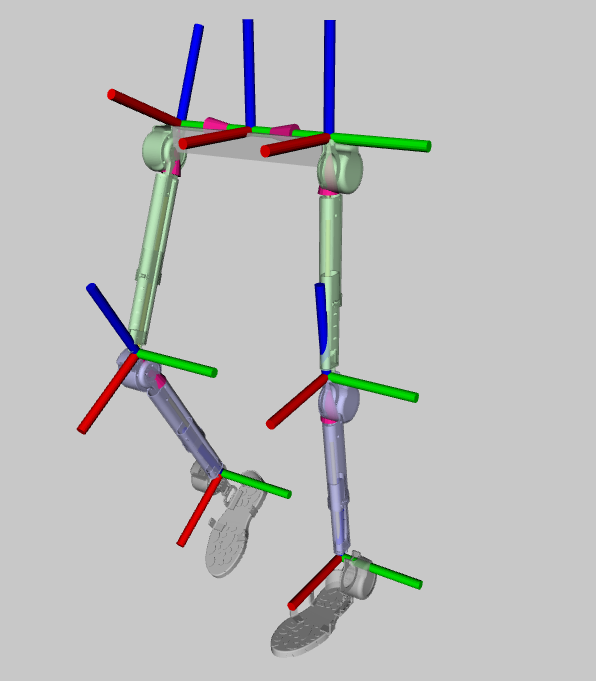
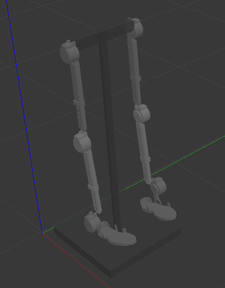

## `yr-ros-ws` 

## Packages

- `yr_lle_msgs`: Contains custom message definitions used for joint commands and states.
- `yr_lle_driver`: Manages hardware communication, sending commands to the robot's motors and reading sensor data.
- `yr_lle_sim`: Provides simulation and visualization tools for testing and development purposes.

## Installation

Prerequisites
- ROS 2 Foxy (or newer)
- Python 3.6 (or newer)

Optional:
- Gazebo 11 (or newer) for simulation

---

## Building the Workspace

```bash
cd yr-ros-ws
colcon build
source install/setup.bash
# echo "source <path-to-yr-ros-ws>/install/setup.bash" >> ~/.bashrc
# source ~/.bashrc
```

---

### API (Topics and Message Types)

| Topic                     | Message Type                        | Max Data Rate |
|---------------------------|-------------------------------------|---------------|
| `/l/ank/motor/imu`        | `sensor_msgs/msg/Imu`               | 200 Hz        |
| `/l/ank/motor/joint_cmd`  | `yr_lle_msgs/msg/JointCmd`          | 500 Hz        |
| `/l/ank/motor/joint_state`| `yr_lle_msgs/msg/JointState`        | 500 Hz        |
| `/l/hip/motor/imu`        | `sensor_msgs/msg/Imu`               | 200 Hz        |
| `/l/hip/motor/joint_cmd`  | `yr_lle_msgs/msg/JointCmd`          | 500 Hz        |
| `/l/hip/motor/joint_state`| `yr_lle_msgs/msg/JointState`        | 500 Hz        |
| `/l/kne/motor/imu`        | `sensor_msgs/msg/Imu`               | 200 Hz        |
| `/l/kne/motor/joint_cmd`  | `yr_lle_msgs/msg/JointCmd`          | 500 Hz        |
| `/l/kne/motor/joint_state`| `yr_lle_msgs/msg/JointState`        | 500 Hz        |
| `/r/ank/motor/imu`        | `sensor_msgs/msg/Imu`               | 200 Hz        |
| `/r/ank/motor/joint_cmd`  | `yr_lle_msgs/msg/JointCmd`          | 500 Hz        |
| `/r/ank/motor/joint_state`| `yr_lle_msgs/msg/JointState`        | 500 Hz        |
| `/r/hip/motor/imu`        | `sensor_msgs/msg/Imu`               | 200 Hz        |
| `/r/hip/motor/joint_cmd`  | `yr_lle_msgs/msg/JointCmd`          | 500 Hz        |
| `/r/hip/motor/joint_state`| `yr_lle_msgs/msg/JointState`        | 500 Hz        |
| `/r/kne/motor/imu`        | `sensor_msgs/msg/Imu`               | 200 Hz        |
| `/r/kne/motor/joint_cmd`  | `yr_lle_msgs/msg/JointCmd`          | 500 Hz        |
| `/r/kne/motor/joint_state`| `yr_lle_msgs/msg/JointState`        | 500 Hz        |

### Message Types

`sensor_msgs/msg/Imu`: Reports the raw IMU data, including orientation, angular velocity, and linear acceleration.

#### Custom Message Types

`yr_lle_msgs/msg/JointCmd`: Used for sending command to the joints.
`yr_lle_msgs/msg/JointState`: Reports the state of a joint, including position, velocity, current, and encoder value.

---

### Running Visualization

```bash
colcon build && ros2 launch yr_lle_sim rviz.launch.py
ros2 launch yr_lle_sim rviz_model.launch.py
```



---

### Running Simulation

```bash
# Install dependencies
sudo apt install ros-<distro>-xacro -y
# Build packages
colcon build 
# Terminal 1
ros2 launch yr_lle_sim gazebo.launch.py
# Terminal 2
ros2 launch yr_lle_sim gazebo_model.launch.py
```



---

### Plotting

```bash
sudo apt install ros-iron-plotjuggler -y
ros2 run plotjuggler plotjuggler
```

---